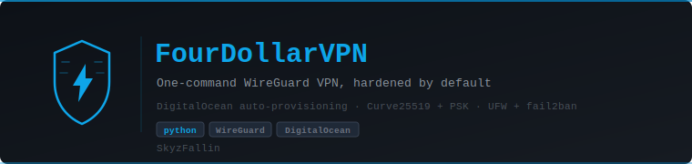

<p align="center">
  
</p>

<p align="center">
  
  
  
  
  
</p>

# FourDollarVPN

**"I got 4 on it."**

Set up a personal WireGuard VPN in one command. No networking knowledge required.

**Author:** [SkyzFallin](https://github.com/SkyzFallin)

FourDollarVPN creates a DigitalOcean server, installs WireGuard, configures everything, and hands you a ready-to-import config file. The whole process takes about 2 minutes.

## Download & Run

**Prerequisites:**
- A [DigitalOcean](https://www.digitalocean.com/) account + [API token](https://cloud.digitalocean.com/account/api/tokens). That's it.

**Grab the binary for your OS from the [latest release](https://github.com/SkyzFallin/FourDollarVPN/releases/latest):**

| OS | Download |
|---|---|
| Windows x64 | `fourdollarvpn-windows-x64.exe` |
| macOS (Apple Silicon) | `fourdollarvpn-macos-arm64` |
| macOS (Intel) | `fourdollarvpn-macos-x64` |
| Linux x64 | `fourdollarvpn-linux-x64` |

No Python install required — the binary bundles everything.

**Windows:** double-click the `.exe`, or run it from PowerShell. Running it with no arguments walks you through the full first-time setup (token prompt → region picker → VPN provisioned).
If SmartScreen warns "unrecognized publisher" → click **More info** → **Run anyway**. (We don't have code-signing set up yet; this is a known quirk for unsigned binaries.)

**macOS:** `chmod +x ./fourdollarvpn-macos-arm64 && ./fourdollarvpn-macos-arm64 init`. The first time, right-click → **Open** to bypass Gatekeeper (also unsigned — on the roadmap).

**Linux:** `chmod +x ./fourdollarvpn-linux-x64 && ./fourdollarvpn-linux-x64 init`.

### Install from source instead (for developers)

If you already have Python 3.9+ and `pipx`:

```bash
pipx install git+https://github.com/SkyzFallin/FourDollarVPN.git@v1.0.0
```

Or with pip / a local clone:

```bash
git clone https://github.com/SkyzFallin/FourDollarVPN.git
cd FourDollarVPN
pip install -e .
python -m fourdollarvpn --help   # works even if the Scripts dir isn't on PATH
```

## Quick Start

```bash
# Save your DigitalOcean API token once
fourdollarvpn init

# Create your VPN (interactive region picker)
fourdollarvpn setup
```

That's it. You'll get a `.conf` file — import it into the WireGuard app on your device.

Already have a token you want to use for just one command? Pass `--token ...` or `export DO_API_TOKEN=...` instead of running `init`.

> **`fourdollarvpn: command not found`?** If you installed from source via `pip install -e .`, Python's `Scripts/` (Windows) or `bin/` (macOS/Linux) directory isn't on your PATH. Every example in this README that starts with `fourdollarvpn ...` also works as `python -m fourdollarvpn ...` — same result, no PATH setup needed. So `fourdollarvpn init` becomes `python -m fourdollarvpn init`, `fourdollarvpn setup` becomes `python -m fourdollarvpn setup`, and so on. Prebuilt binary users don't hit this because the binary is invoked directly (`./fourdollarvpn setup` or `fourdollarvpn.exe setup`).

### Install WireGuard Client

- **Windows / Mac / Linux**: [wireguard.com/install](https://www.wireguard.com/install/)
- **iOS**: [App Store](https://apps.apple.com/us/app/wireguard/id1441195209)
- **Android**: [Play Store](https://play.google.com/store/apps/details?id=com.wireguard.android)

## Commands

Every command needs a DigitalOcean API token. The simplest way is to save it once with `fourdollarvpn init`. Precedence:

1. `--token` flag on the command
2. `DO_API_TOKEN` environment variable
3. Saved token from `fourdollarvpn init`

### `fourdollarvpn init`

Save your DigitalOcean API token so other commands don't need it passed every time. Verifies the token against DigitalOcean's API before saving.

```bash
$ fourdollarvpn init
DigitalOcean API token: ****
✓ Token verified and saved to ~/.config/fourdollarvpn/config.json
```

On Windows the token saves to `%LOCALAPPDATA%\fourdollarvpn\config.json` — deliberately *not* `%APPDATA%`, which OneDrive's Known Folder Move silently syncs to the cloud.

The file is chmod 600 (owner read/write only). To change the token later, run `init` again. To forget it (and delete all local FourDollarVPN state), run `fourdollarvpn uninstall`.

### `fourdollarvpn setup`

Create a new VPN server.

```bash
fourdollarvpn setup [--region REGION] [--lock] [--open-qr] [-y] [-o OUTPUT]
```

| Flag | Description |
|------|-------------|
| `--token` | DigitalOcean API token (or use `DO_API_TOKEN` env var) |
| `--region` | Region slug (e.g. `nyc1`, `sfo3`, `ams3`) — interactive if omitted |
| `--lock` | Block inbound SSH via UFW after setup. Breaks every SSH-dependent command (`add-client`, `check`, `list-clients`, `remove-client`) until `destroy` + `setup`. The SSH daemon keeps running — access is blocked at the firewall, not the service — so DigitalOcean's web console still works for recovery **if** you've added your own SSH key or password via the DO dashboard first (FourDollarVPN doesn't set one up for you). |
| `--open-qr` | Automatically open the generated QR code in your default browser |
| `-y`, `--yes` | Skip the confirmation prompt. If an existing FourDollarVPN droplet is found it will be destroyed and replaced. |
| `-o`, `--output` | Custom output path for the config file |

While setup runs you'll see a progress bar with spinner, current step, elapsed time, and step counter. Typical total: 2–5 minutes, depending on the region and how quickly the new droplet fetches packages.

If you already have a FourDollarVPN droplet in your account when you run `setup`, you'll see the list and be asked:
```
Continuing will destroy the droplet(s) above and create a new one.
Proceed? [y/N]:
```
Answer `y` to replace it; anything else cancels. Pass `-y` to skip the confirmation.

After setup completes, a full `apt upgrade` runs in the background on the server (~2–5 min). Your VPN works during and after; no action needed.

**Setup also does a stale-file sweep.** Before creating the droplet, it scans your current directory and home folder for `fdvpn-*.conf` files. Any that point at a droplet DigitalOcean no longer has are flagged as stale and you're prompted whether to delete them (with matching `.svg` QR codes). Useful for not accumulating dead configs across repeated setups.

### `fourdollarvpn status`

List your active FourDollarVPN servers.

```bash
fourdollarvpn status
```

### `fourdollarvpn check`

SSH into your droplet and verify everything is healthy — services, firewall, WireGuard, and the background system upgrade.

```bash
fourdollarvpn check [--ip SERVER_IP]
```

Output shows ✓/✗ for each component plus useful extras like latest WireGuard handshake, listening ports, and whether a reboot is required.

Useful for:
- Checking if the background upgrade finished
- Verifying all hardening stayed in place after an upgrade
- Confirming a remote client is actually connecting (handshake time)

Doesn't work if you used `--lock` during setup (no SSH access).

### `fourdollarvpn destroy`

Tear down a VPN server and stop billing.

```bash
fourdollarvpn destroy [--droplet-id ID] [-y]
```

Without `--droplet-id`, you get an interactive picker:
```
 # │ Name              │ IP              │ Region
 1 │ fourdollarvpn-12345    │ 209.38.134.149  │ sfo3
 2 │ fourdollarvpn-67890    │ 104.248.1.2     │ nyc1

Enter # to destroy (1-2), 'all', or 'q' to cancel:
```

Type `1`, `2`, `all`, or press Enter / `q` to cancel. No full droplet ID memorization required.

### `fourdollarvpn add-client`

Generate a config for an additional device (phone, laptop, tablet, etc.). Use this after setup whenever you want to put your VPN on another device.

```bash
fourdollarvpn add-client [--ip SERVER_IP] [--name NAME] [--open-qr] [-o OUTPUT]
```

| Flag | Description |
|------|-------------|
| `--token` | DigitalOcean API token (or use `DO_API_TOKEN` env var) |
| `--ip` | Server IP. Auto-detected if you only have one FourDollarVPN droplet — otherwise required |
| `--name` | Optional label for this client (`phone`, `laptop`, `work-mac`). Shown in `list-clients` and baked into the generated filename. 1–32 chars from `[A-Za-z0-9_-]`. |
| `--open-qr` | Automatically open the generated QR code in your default browser |
| `-o`, `--output` | Custom output path for the new client config file |

**What it does:**

1. Generates a new client keypair + PreSharedKey **locally on your machine** (the private key never touches the server)
2. SSHes into the droplet and assigns the next free VPN IP (`10.66.66.3`, then `.4`, etc.)
3. Adds the new peer to the server's WireGuard config *and* live-adds it to the running interface — no restart, existing clients stay connected
4. If you passed `--name`, writes a `# fourdollarvpn: name=<name>` comment above the peer block on the server. WireGuard ignores comments; every machine that manages this droplet sees the same name. Names show up in `list-clients` and `remove-client` can target them directly (`fourdollarvpn remove-client phone`).
5. Saves two files locally. The filename encodes VPN IP, optional label, and creation time so nothing ever collides silently:
   - `fdvpn-<name>-<vpn-ip>-<HHMM>.conf` (e.g. `fdvpn-phone-10-66-66-3-1414.conf`) — the short prefix keeps the tunnel name inside WireGuard for Windows' 32-character limit
   - `...svg` — same base name, open in any image viewer/browser to scan with a phone
6. Prints a QR code in the terminal for instant mobile scanning
7. Scans the output directory for configs pointing at droplets DO no longer has and prompts to delete them (same sweep as `setup`)

**Example:**

```bash
# You already have a VPN running. Now you want to add your phone:
fourdollarvpn add-client --open-qr

# → The QR pops up in your browser. Scan with the WireGuard app. Done.
```

**Limits:**

- Up to 253 clients per server (IPs `10.66.66.2` through `10.66.66.254`)
- Requires SSH to still be open on the droplet — if you ran `setup --lock`, you'll need to `destroy` + `setup` again to add more clients

### `fourdollarvpn list-clients`

Show every device currently configured on the VPN server — VPN IP, the public key prefix, and when each one last handshook with the server (useful for spotting stale or unused clients).

```bash
fourdollarvpn list-clients [--ip SERVER_IP]
```

### `fourdollarvpn remove-client`

Revoke a single client without affecting any others. Use this if a phone or laptop is lost, stolen, or just no longer needs access.

```bash
# Pick interactively from a numbered list
fourdollarvpn remove-client

# Remove by name (from --name at add-client time)
fourdollarvpn remove-client phone

# Remove by VPN IP
fourdollarvpn remove-client 10.66.66.3

# Remove by public-key prefix (8+ chars)
fourdollarvpn remove-client AbCdEf12

# Skip the "are you sure?" prompt
fourdollarvpn remove-client phone -y
```

The removal is atomic: the peer is taken off the running interface *and* deleted from the on-disk config in a single locked operation. Other clients keep connecting. The revoked device's existing `.conf` file is immediately inert — it'll just fail to handshake.

### `fourdollarvpn uninstall`

Remove FourDollarVPN's saved state from this computer — the token, pinned host keys, and the per-droplet SSH keys used for management. Does **not** touch running droplets (run `fourdollarvpn destroy` first if you also want to stop billing) and does not delete the binary itself.

```bash
fourdollarvpn uninstall [-y]
```

If a saved token is still valid when you run this, you'll see a heads-up listing any droplets still running on your account before confirming.

### Double-click / no-argument launch (Windows especially)

If you run the binary with no subcommand — double-clicking the `.exe`, or running `fourdollarvpn` bare — you get a guided menu instead of the help screen:

- **No token yet**: falls through to `init` + `setup`.
- **Token is saved but no FourDollarVPN droplet exists**: falls through to `setup`.
- **A droplet already exists**: you see a table of what's there and a five-option menu (add a device / check / rebuild / destroy / uninstall). Options that would need the local SSH management key are annotated and refused if the key isn't present on this machine (e.g. droplet was set up on a different computer).

Designed for non-CLI users on Windows who land on the `.exe` and aren't sure what to type. All the same commands are reachable from the command line.

## How It Works

1. Creates a small Ubuntu 24.04 server on DigitalOcean (~$4/month, size `s-1vcpu-512mb-10gb`). The droplet is tagged `fourdollarvpn` at creation so it's easy to identify later, and per-droplet state on your machine is keyed by DigitalOcean's droplet ID rather than the IP — if DO recycles an IP, the CLI doesn't get confused.
2. Connects via SSH using an Ed25519 key generated in-process. After setup succeeds, that private key is persisted locally (see *Key Separation* below) so `check` / `add-client` / `list-clients` / `remove-client` can reach the server again later. The public half gets deleted from your DO account immediately — the only copy that matters lives in the droplet's `authorized_keys`.
3. Pins the droplet's SSH host key on first contact — subsequent management calls reject any key mismatch, so a spoofed IP can't impersonate the server.
4. Installs WireGuard and generates encryption keys — **client private key is generated locally on your machine and never touches the server**
5. Configures the firewall to only allow VPN traffic; `ufw limit 22/tcp` rate-limits SSH on top of fail2ban
6. Hardens SSH as the final provisioning step (so a mid-provision sshd restart can't sever the session and break the rest of setup)
7. Enables automatic security updates via `unattended-upgrades`, with conditional reboot: if an update needs a reboot, the server reboots itself at **04:00 UTC** on the day it's needed (globally quiet window — ~9pm PST / midnight EST / 5am London / noon JST). Reboots only happen on days when `/var/run/reboot-required` exists, never arbitrarily. Typically fires once every 1–2 weeks for kernel / glibc updates.
8. Kicks off a full `apt upgrade` as a detached systemd unit — survives our SSH disconnect, runs to completion autonomously (~2–5 min)
9. Writes the client config (`.conf`) and a scannable QR code (`.svg`) atomically with `0600` perms and `O_NOFOLLOW` (no readable window, no symlink-follow). Filenames embed the VPN IP, optional name label, and creation time so re-added clients never clobber each other.

All traffic from your device gets encrypted and routed through the server, hiding your activity from your ISP and protecting you on public WiFi.

## Importing the Config

Every `setup` and `add-client` run saves two files side by side:

- `fdvpn-...conf` — the raw WireGuard config
- `fdvpn-...svg` — a scannable QR code of the same config

**Desktop (Windows / Mac / Linux):**
Open WireGuard → **Add Tunnel** → **Import from file** → pick the `.conf`. Activate.

**Mobile (iOS / Android):**
Fastest: run with `--open-qr` so the QR pops up in your browser on the computer, then scan it with the WireGuard app on your phone.
Also works: scan the terminal QR code directly.

**Pasting config text into WireGuard:**
WireGuard desktop apps can also import by pasting raw config text. Handy if you need to email/message the config to yourself to get it onto another device. **Add Tunnel** → **Add empty tunnel...** → paste → **Save**.

**Transferring configs between devices** (when one device can't run FourDollarVPN itself):
- Email the `.conf` to yourself
- Signal / Slack / Discord to yourself (file is <1 KB)
- USB stick, cloud drive, or LAN share

> ⚠️ Don't reuse the same config on two devices simultaneously. WireGuard peer-roams to whichever device sent a packet most recently and traffic will flip-flop. Use `add-client` for each device — takes 10 seconds.

## Mobile-Only Users

FourDollarVPN is a Python CLI — it needs *something* that can run Python. A few options if you only have a phone:

**Android:** install [Termux](https://termux.dev/) (F-Droid version), then:
```bash
pkg install python git
git clone https://github.com/SkyzFallin/FourDollarVPN.git
cd FourDollarVPN && pip install -e .
fourdollarvpn setup
```

**iOS:** [a-Shell](https://apps.apple.com/app/a-shell/id1473805438) (free, has Python and pip) — functional but clunky on a small screen.

**Any mobile browser:** [Google Cloud Shell](https://shell.cloud.google.com/) gives you a free Linux VM in your browser. Clone the repo, install, run setup, and download the `.conf` from Cloud Shell's file browser.

Easiest overall: borrow any computer for 3 minutes, run setup once, and email yourself the `.conf`. Setup is a one-time thing.

## Security

FourDollarVPN is designed with defense-in-depth. Every server is hardened automatically during setup:

### Cryptography

WireGuard uses state-of-the-art cryptography with no configuration needed:

- **Curve25519** for key exchange
- **ChaCha20-Poly1305** for authenticated encryption
- **BLAKE2s** for hashing
- **SipHash24** for hashtable keys

There are no cipher suites to choose or misconfigure — WireGuard's crypto is fixed and modern.

### Key Separation

Provisioning and operation are fully separated:

- **Cloud API token**: Only used against the DigitalOcean API. With `fourdollarvpn init`, the token is persisted to `~/.config/fourdollarvpn/config.json` (or `%LOCALAPPDATA%\fourdollarvpn\config.json` on Windows) with `0600` perms so `pip`, the CLI, and other processes don't see it in environment or argv. On Windows this is deliberately **not** `%APPDATA%` — that path is OneDrive-synced by Known Folder Move, which would silently upload the token to the cloud. If you'd rather not persist it, skip `init` and pass `--token ...` or `export DO_API_TOKEN=...` per session — FourDollarVPN honors the precedence `--token` → env var → saved config. The token never appears in a subprocess `argv` or on the WireGuard server itself.
- **SSH management key**: An Ed25519 keypair is generated during `fourdollarvpn setup`. The public half is uploaded to DigitalOcean *just* for droplet creation (DO copies it into `/root/.ssh/authorized_keys`), then immediately deleted from your DO account. The private half is saved locally at `~/.fourdollarvpn/servers/<droplet-id>.key` (or `%LOCALAPPDATA%\fourdollarvpn\servers\<droplet-id>.key` on Windows) with `0600` perms. This is the only copy, and it's the only thing that lets the CLI re-authenticate for `check` / `add-client` / `list-clients` / `remove-client`. Files are keyed by the DigitalOcean droplet ID, not its IP — so if DO recycles an IP to a different droplet, the CLI can't be tricked into trusting a stranger's server.
- **SSH host-key pinning**: The droplet's SSH host key is saved on first contact (under the same per-user directory). If the key ever changes between runs, the CLI fails fast with a clear MITM-aware error instead of silently trusting the new key.
- **VPN keys**: Client private key is generated **locally on your device** (using `cryptography`'s X25519) and never touches the server. Only the public key is sent. Server private key is generated on the server and never leaves it (the public half is derived via `wg pubkey` reading stdin, so the private key never appears in the server's process `argv`).

### Server Hardening

Every server is hardened automatically before any ports are exposed:

- **Root SSH is key-only**: password authentication is disabled (`PasswordAuthentication no`, `PermitRootLogin prohibit-password`). If you need to manage the server directly, add your own SSH public key via the DigitalOcean dashboard, or use DigitalOcean's built-in web console for recovery.
- **fail2ban + UFW rate limit**: SSH gets a 5-failure / 1-hour ban from fail2ban, plus UFW's built-in connection rate limiter (`ufw limit 22/tcp`) as a second layer.
- **Firewall (UFW)**: All inbound traffic is blocked except SSH (22/tcp) and WireGuard (51820/udp). Use `--lock` to also firewall-block SSH after setup (the SSH daemon keeps running; it's just unreachable from the internet). DigitalOcean's web console still works if you need recovery.
- **Kernel hardening**: sysctl settings for reverse-path filtering, SYN cookies, disabled ICMP redirects, disabled source routing, disabled IPv6, and martian-packet logging are applied via `/etc/sysctl.d/99-fourdollarvpn-hardening.conf`.
- **Automatic security updates**: `unattended-upgrades` keeps the server patched without intervention.
- **Fresh server per deployment**: Every `fourdollarvpn setup` creates a brand new droplet. No shared templates, no drift.
- **No dashboards or web admin**: The server runs WireGuard and nothing else. No control panels, no web UIs, no non-root users.
- **No traffic logs**: WireGuard does not log traffic by design. No session logging to disable.
- **Redacted errors**: WireGuard keys, DigitalOcean API tokens, and PEM-encoded private-key blocks are automatically scrubbed from every user-visible error message.
- **Atomic peer operations**: `add-client` and `remove-client` hold a server-side `flock` for the entire read/allocate/write sequence — two concurrent calls can't collide on the same IP, a failed `wg set` leaves the on-disk config unchanged, and removed peers' IPs get reused correctly.

### Client Security

- **Local key generation**: Your VPN private key is generated on your device using Curve25519 and never leaves it.
- **DNS leak protection**: Client configs use Cloudflare DNS (1.1.1.1, 1.0.0.1) to prevent your ISP from seeing DNS queries.
- **Full tunnel (IPv4)**: `AllowedIPs = 0.0.0.0/0` routes ALL IPv4 traffic through the VPN. IPv6 is intentionally not tunneled — the server is provisioned without IPv6 (DigitalOcean droplet `ipv6=false`, kernel `disable_ipv6=1`) so IPv6 traffic stays on your local interface rather than silently blackholing. If your network is IPv6-only, enable the kill switch in your WireGuard client to block traffic rather than fall back to clear IPv6.
- **Atomic, 0600 client-config writes**: the `.conf` and `.svg` files are written with `O_NOFOLLOW` and `mode=0o600` — no readable window, no symlink follow.
- **Stored token**: If you run `fourdollarvpn init`, the API token is saved to `~/.config/fourdollarvpn/config.json` (Linux/macOS) or `%LOCALAPPDATA%\fourdollarvpn\config.json` (Windows — kept off OneDrive's Roaming sync) with `0600` perms. If you'd rather not persist it, skip `init` and use `--token` or `DO_API_TOKEN` per session.

### Kill Switch

A kill switch prevents traffic from leaking if the VPN connection drops. WireGuard's `AllowedIPs = 0.0.0.0/0` acts as a basic kill switch — when the tunnel is active, all traffic is routed through it. For extra protection:

**Linux (iptables):**
```bash
# Only allow traffic through the WireGuard interface
sudo iptables -I OUTPUT ! -o wg0 -m mark ! --mark $(wg show wg0 fwmark) -m addrtype ! --dst-type LOCAL -j REJECT
# To remove:
sudo iptables -D OUTPUT ! -o wg0 -m mark ! --mark $(wg show wg0 fwmark) -m addrtype ! --dst-type LOCAL -j REJECT
```

**Windows / macOS / mobile:**
The WireGuard app has a built-in kill switch. Enable "Block untunneled traffic (kill-switch)" in the tunnel settings (called "On-Demand" on iOS/macOS).

### Revoke Your API Token After Setup

Once your VPN is running, you no longer need the DigitalOcean API token. Revoking it eliminates the risk of token compromise.

1. Go to [DigitalOcean API Tokens](https://cloud.digitalocean.com/account/api/tokens)
2. Find the token you used and click **More** > **Delete**
3. Confirm deletion

> **Note**: After revoking, all management commands (`status`, `check`, `destroy`, `add-client`, `list-clients`, `remove-client`) will no longer work. You can still manage the droplet directly from the DigitalOcean dashboard, and your VPN will continue to function normally.

If you want to keep management access, keep a full-access token in `fourdollarvpn init` or `DO_API_TOKEN` — the VPN doesn't need one to run, only the CLI does. A read-only token is not sufficient for `destroy` or `remove-client`.

## Cost

DigitalOcean's smallest droplet costs ~$4/month. Destroy your VPN anytime with `fourdollarvpn destroy` to stop billing.

## License

MIT
